# Expando — Roadmap 2026

**Versione attuale:** v3.29.13
**Posizionamento:** text expander open-source, privacy-first, solo macOS  
**Principio guida:** tutto locale, niente account, niente telemetry

---

## Stato attuale (baseline v3.26.0 — soluzione completa)

| Area | Stato |
|------|--------|
| Engine + trigger literal/regex | ✓ |
| App rules (name, bundle, title) | ✓ |
| Variabili (date, shell, clipboard, random, unicode) | ✓ |
| Form multi-campo | ✓ |
| Fuzzy search + AppKit UI | ✓ |
| Menu bar + daemon + LaunchAgent | ✓ |
| Import Espanso + package hub | ✓ |
| Backup/restore, doctor, CLI completa | ✓ |
| Distribuzione firmata/notarizzata + Homebrew | ✓ |
| Permission wizard + Doctor v2 + i18n IT | ✓ |
| Notifiche blocco espansione + `expando logs` | ✓ |
| Snippet editor grafico (trigger/replace/form/vars) | ✓ |
| Hub packages (8 curati) + `expando hub publish` | ✓ |
| Export/duplica snippet + statistiche locali opt-in | ✓ |
| `expando registry` (hub + plugin catalog) | ✓ |
| Sparkle appcast + update check + Homebrew cask | ✓ |
| Sito GitHub Pages | ✓ |
| Plugin API + script vars + `when:` | ✓ |
| Import TextExpander / Raycast | ✓ |
| Benchmark engine + crash reporting locale | ✓ |
| Snippet templates CLI + security audit | ✓ |
| CLI/menu bar localizzati (IT default) | ✓ |
| Changelog in-app post-update | ✓ |
| Test (180+) + E2E su runner self-hosted | ✓ |
| Sync assistito CLI (`expando sync`) | ✓ v2.7.0 |
| Sparkle.framework nativo (distribution build) | ✓ v2.7.0 |
| Hub marketplace submit + merge remoto | ✓ v2.7.0 |
| Notarization audit CLI + CI periodico | ✓ v2.8.0 |
| E2E clipboard con TCC su runner self-hosted | ✓ v2.8.0 |
| Hub marketplace review/approval flow | ✓ v2.8.0 |
| Hub portal export/sync remoto | ✓ v2.9.0 |
| Notarization audit JSON artifact | ✓ v2.9.0 |
| E2E image clipboard su runner | ✓ v2.9.0 |
| Hub marketplace GitHub Pages | ✓ v3.0.0 |
| Notarization audit history locale | ✓ v3.0.0 |
| E2E engine image trigger | ✓ v3.0.0 |
| Hub marketplace URL predefinito (Pages) | ✓ v3.1.0 |
| CI E2E headless-safe (tier integration) | ✓ v3.1.0 |
| Notarization history JSON + CI cache | ✓ v3.1.0 |
| Hub community packages su Pages (3 approvati) | ✓ v3.2.0 |
| Notarization history trend in doctor | ✓ v3.2.0 |
| Sparkle helper signing audit | ✓ v3.2.0 |
| Hub submit workflow contributor (`run`, `status`, `--queue`) | ✓ v3.3.0 |
| Doctor hint su audit fail | ✓ v3.3.0 |
| Benchmark Sparkle/appcast (`--sparkle`) | ✓ v3.3.0 |
| Hub submit init template (`hub submit init`) | ✓ v3.4.0 |
| Doctor marketplace remoto (community installabili) | ✓ v3.4.0 |
| Release CI Sparkle helper smoke test | ✓ v3.4.0 |
| CI `hub validate-community` pre-submit gate | ✓ v3.5.0 |
| Doctor marketplace sync preview (remoto vs locale) | ✓ v3.5.0 |
| Benchmark Sparkle helper update-check latency | ✓ v3.5.0 |
| CI lint trigger duplicati cross-package community | ✓ v3.6.0 |
| Doctor alert pending remoti non sincronizzati | ✓ v3.6.0 |
| Release CI artifact benchmark Sparkle helper | ✓ v3.6.0 |
| Validazione trigger community vs package ufficiali | ✓ v3.7.0 |
| Doctor diff metadata pending marketplace | ✓ v3.7.0 |
| Release CI soglia warning latenza helper Sparkle | ✓ v3.7.0 |
| Suggerimenti trigger community vicini a ufficiali (warning) | ✓ v3.8.0 |
| Export JSON pending diff marketplace (`hub portal pending-diff`) | ✓ v3.8.0 |
| Storico latenza helper Sparkle multi-versione in release | ✓ v3.8.0 |
| Scoring fuzzy trigger community vs ufficiali (score + reason) | ✓ v3.9.0 |
| `expando doctor --marketplace-json` export diagnostico | ✓ v3.9.0 |
| Benchmark Sparkle fail threshold + trend sparkline in history | ✓ v3.9.0 |
| Dashboard HTML suggerimenti trigger (`validate-community --html`) | ✓ v3.10.0 |
| Doctor report completo + marketplace JSON (`doctor --marketplace-json`) | ✓ v3.10.0 |
| Release CI strict fail Sparkle helper (`EXPANDO_SPARKLE_HELPER_STRICT`) | ✓ v3.10.0 |
| Dashboard trigger su GitHub Pages (`publish-site` + link) | ✓ v3.11.0 |
| `expando doctor --doctor-json` export strutturato | ✓ v3.11.0 |
| Benchmark SVG trend in artifact release (`--svg`) | ✓ v3.11.0 |
| `expando doctor --full-json` export health completo | ✓ v3.12.0 |
| Notarization history trend SVG (`notarize-audit --svg`) | ✓ v3.12.0 |
| Release CI artifact `doctor-full.json` + notarize SVG | ✓ v3.12.0 |
| `expando doctor --full-html` health dashboard HTML | ✓ v3.13.0 |
| CI gate `validate-community --html` | ✓ v3.13.0 |
| Release CI artifact `doctor-health.html` | ✓ v3.13.0 |
| Health dashboard con SVG trend inline (notarize + sparkle) | ✓ v3.14.0 |
| `hub-maintainer.html` su GitHub Pages (`publish-site`) | ✓ v3.14.0 |
| CI smoke `doctor --full-html` + `sparkle-benchmark-history --svg` | ✓ v3.14.0 |
| `hub/community-validation.json` su GitHub Pages (`publish-site`) | ✓ v3.15.0 |
| Maintainer portal con badge validation + stats | ✓ v3.15.0 |
| Release CI artifact unificato `release-health` (post-sparkle doctor) | ✓ v3.15.0 |
| `doctor --full-html`: tabelle community validation complete | ✓ v3.16.0 |
| Hub marketplace: badge validation + link `community-validation.json` | ✓ v3.16.0 |
| CI/release: export `community-validation.json` in `release-health` | ✓ v3.16.0 |
| `doctor-health.html` + `hub/doctor-full.json` su GitHub Pages (`publish-site`) | ✓ v3.17.0 |
| Link health dashboard da index/maintainer/marketplace | ✓ v3.17.0 |
| CI smoke `publish-site` health export | ✓ v3.17.0 |
| `hub/index.json` manifest su GitHub Pages (`publish-site`) | ✓ v3.18.0 |
| Release CI sync `doctor-health.html` + `hub/doctor-full.json` su main | ✓ v3.18.0 |
| Pages deploy preserva release health (`EXPANDO_PUBLISH_SITE_SKIP_HEALTH`) | ✓ v3.18.0 |
| Listener watchdog + crash-loop guard + secure-input nativo | ✓ v3.19.0 |
| Doctor injection probe + Input Monitoring gate + `--repair` | ✓ v3.20.0 |
| Editor regole avanzate + wizard DMG + permission deep-link HTML | ✓ v3.21.0 |
| Editor preview live + backup/restore menu bar + restart reale | ✓ v3.22.0 |
| Sparkle parity + Homebrew cask bump CI + Formula deprecata | ✓ v3.23.0 |
| `hub upgrade` / `hub outdated` + notifiche hub + 10 community | ✓ v3.24.0 |
| `expando health` + support bundle + E2E secure-input/watchdog | ✓ v3.25.0 |
| Auto-backup + sync conflict + plugin allowlist + docs complete | ✓ v3.26.0 |

### Gap residui (post v3.29.6)

- **E2E runner:** clipboard/secure-input richiedono runner self-hosted con TCC (`EXPANDO_E2E_FULL=1`, `EXPANDO_E2E_TEXTEDIT=1`)
- **Secondo runner E2E:** workflow nightly presente; failover fisico ancora opzionale
- **Hub packages:** ampliare catalogo community oltre i 10 attuali

### Sprint 38 → v3.29.0 ✓

1. **T10-01** Wizard DMG: badge Accessibilità + Monitoraggio input, recheck su entrambi i passi
2. **T10-02** Menu bar: badge 🔒 permessi, voce Permessi → wizard, stato runtime (`expando health`)
3. **T10-03** Snooze 1h/4h in menu bar + badge ⏸; engine rispetta pausa temporanea
4. **T10-04** Hub upgrade in-app: diff YAML prima dell'upgrade + conferma nativa
5. **T10-05** `doctor --repair` reinstalla LaunchAgent se plist obsoleto
6. **T10-06** Editor: placeholder ricerca i18n; soak health script documentato

### Sprint 37 → v3.28.0 ✓

1. **T9-01** Listener watchdog retry + permission notify all'avvio
2. **T9-02** Engine/daemon threading: no deadlock, no doppia istanza al restart
3. **T9-03** Crash loop integrato, JSON atomici, config reload stabile, doctor repair safe mode

### Sprint 36 → v3.27.0 ✓

1. **T8-01** Homebrew tap PR automatica da release CI
2. **T8-02** Editor: duplica/sposta snippet tra file con picker dedicato
3. **T8-03** Menu bar polish: backup/restore/restart/aggiornamenti con dialog nativi

---

## Visione

**Expando 2.x** = il text expander che conosci e controlli: YAML per power user, UI per tutti, hub di snippet condivisibili, zero cloud obbligatorio.

```mermaid
flowchart LR
  subgraph v14 [v1.4 Onboarding]
    A[Permission wizard]
    B[Doctor migliorato]
    C[Notifiche contestuali]
  end
  subgraph v15 [v1.5 Editor]
    D[Snippet editor AppKit]
    E[Hub ampliato]
    F[Migrazione Espanso 1-click]
  end
  subgraph v16 [v1.6 Distrib]
    G[Sparkle auto-update]
    H[Homebrew cask]
    I[Sito + docs]
  end
  subgraph v20 [v2.0 Platform]
    J[Plugin API Python]
    K[Script vars]
    L[Sync opzionale git/iCloud]
  end
  v14 --> v15 --> v16 --> v20
```

---

## Tier 3 — Product polish (v1.4 → v1.6)

### v1.4 — Onboarding & affidabilità
**Obiettivo:** chi installa Expando capisce subito cosa fare e perché non espande.

| ID | Feature | Descrizione | Stato |
|----|---------|-------------|-------|
| T3-01 | **Permission wizard** | Finestra al primo avvio: Accessibility, Input Monitoring, passo-passo con link a Impostazioni | ✓ |
| T3-02 | **Doctor v2** | Check esplicito Input Monitoring; test injection di prova; suggerimenti per Expando.app vs python | ✓ |
| T3-03 | **Notifiche contestuali** | Toast quando espansione bloccata (secure input, `if_app`, shell deny) | ✓ |
| T3-04 | **Log strutturato** | `expando logs --tail` + rotazione; livelli debug per supporto | ✓ |
| T3-05 | **Statistiche locali** | Conteggio espansioni per trigger (file JSON locale, opt-in) | ✓ v2.6.0 |

**Release target:** Q3 2026  
**Criterio di done:** nuovo utente da DMG → snippet funzionante in < 5 min senza leggere il README.

---

### v1.5 — Editor & contenuti
**Obiettivo:** non serve più aprire YAML per l'uso quotidiano.

| ID | Feature | Descrizione | Stato |
|----|---------|-------------|-------|
| T3-06 | **Snippet editor AppKit** | Lista snippet, crea/modifica/elimina, anteprima live, regole app semplificate | ✓ v2.5.0 |
| T3-07 | **Migrazione Espanso** | `expando migrate-espanso` con report (importati/saltati/errori) e backup automatico | ✓ |
| T3-08 | **Hub ampliato** | 5–10 package curati (dev, email IT, legal, social); `index.json` versionato | ✓ v2.5.0 (8) |
| T3-09 | **Hub submit** | `expando hub publish` da cartella locale + validazione schema | ✓ v2.5.0 |
| T3-10 | **Duplica / export snippet** | `expando export`, `expando duplicate` | ✓ v2.6.0 |

**Release target:** Q4 2026  
**Criterio di done:** creare `:email` con form dalla UI senza toccare YAML.

---

### v1.6 — Distribuzione & discoverability
**Obiettivo:** installazione e aggiornamento frictionless per utenti non-dev.

| ID | Feature | Descrizione | Stato |
|----|---------|-------------|-------|
| T3-11 | **Sparkle auto-update** | Feed appcast firmato; check silenzioso + notifica | ✓ (Python appcast) |
| T3-12 | **Homebrew cask** | `brew install --cask expando` con DMG precompilato | ✓ |
| T3-13 | **Sito progetto** | Landing + docs (install, YAML reference, hub); GitHub Pages o sito Inochi | ✓ |
| T3-14 | **Changelog in-app** | "What's new" alla prima apertura post-update | ✓ |
| T3-15 | **Notarization hardening** | Hardened runtime audit; entitlement review periodico | ✓ v2.8.0 |

**Release target:** Q1 2027  
**Criterio di done:** utente Homebrew cask riceve update senza rebuild locale.

---

## Tier 4 — Estensibilità (v2.0)

**Obiettivo:** Expando come piattaforma, non solo app.

| ID | Feature | Descrizione | Priorità |
|----|---------|-------------|----------|
| T4-01 | **Plugin API** | Hook Python in `~/Library/Application Support/expando/plugins/` | ✓ v2.0.0 |
| T4-02 | **Variable type `script`** | Esegui script Python con contesto (app, trigger, form values) | ✓ v2.0.0 |
| T4-03 | **Conditional matches** | `when:` / condizioni su variabili o contesto | ✓ v2.0.0 |
| T4-04 | **Sync opzionale** | Cartella config in iCloud Drive o repo git | ✓ v2.7.0 |
| T4-05 | **Import TextExpander / Raycast** | `migrate-textexpander`, `migrate-raycast` con report | ✓ v2.1.0 |
| T4-06 | **Snippet templates** | `expando new`, `templates list` (email, legal-it, dev, …) | ✓ v2.3.0 |
| T4-07 | **Espansione immagini** | Campo `image:` + paste clipboard macOS, fallback `replace` | ✓ v2.4.0 |
| T4-08 | **Editor form/vars UI** | Form multi-campo e variabili nell'editor AppKit | ✓ v2.5.0 |
| T4-09 | **Plugin/snippet registry** | `expando registry` catalogo locale hub + plugin | ✓ v2.6.0 |
| T4-10 | **Sync assistito** | `expando sync` check + guida symlink iCloud/git | ✓ v2.7.0 |

**Release target:** H1 2027  
**Criterio di done:** plugin di terze parti pubblicabile con README + test di esempio.

---

## Tier 5 — Qualità & ops (trasversale)

| ID | Feature | Descrizione | Quando |
|----|---------|-------------|--------|
| T5-01 | **CI self-hosted E2E** | Workflow + runner `macos-MacBook-Pro-di-Inochi-2`, artifact JUnit | ✓ operativo |
| T5-02 | **Benchmark engine** | `expando benchmark` con metriche compile/reload/latency | ✓ v2.2.0 |
| T5-03 | **Localizzazione IT** | CLI, doctor, wizard, menu bar, benchmark, hub (`EXPANDO_LOCALE`) | ✓ v2.5.0 |
| T5-04 | **Security audit** | `expando security-audit` (shell, plugin path, hub HTTPS) | ✓ v2.3.0 |
| T5-05 | **Crash reporting locale** | `crashes/` locale, `expando crashes`, faulthandler | ✓ v2.2.0 |

---

## Tier 6 — Affidabilità engine & daemon (v3.19 → v3.20)

**Obiettivo:** Expando non smette mai di espandere in silenzio; recovery automatico e diagnostica veritiera.

| ID | Feature | Descrizione | Priorità | Sprint |
|----|---------|-------------|----------|--------|
| T6-01 | **Listener watchdog** | Heartbeat sul thread `pynput`, auto-restart listener, indicatore menu bar “listener dead” | P0 | 28 ✓ |
| T6-02 | **Crash-loop guard** | Backoff launchd dopo N crash/10 min; safe mode (espansione disabilitata + alert doctor) | P0 | 28 ✓ |
| T6-03 | **Secure-input nativo** | Sostituire/affiancare probe `osascript` con API native (`IsSecureEventInputEnabled`) per meno falsi negativi | P0 | 28 ✓ |
| T6-04 | **PID/lock repair** | `expando doctor --repair`: riconcilia PID file, flock, processi orfani | P1 | 29 ✓ |
| T6-05 | **Injection degradation** | Notifica + warning doctor dopo N injection fail consecutivi; soglia auto-disable opzionale | P1 | 29 ✓ |
| T6-06 | **Config reload gate** | Validare YAML prima dello swap; rollback a last-good config su errore `compile_matches` | P1 | 29 ✓ |
| T6-07 | **Injection probe doctor** | Prova injection live (micro-test TextEdit) con esito in doctor e `--doctor-json` | P0 | 29 ✓ |
| T6-08 | **Input Monitoring gate** | Input Monitoring come requisito reale per listener globale; warning/blocco in doctor e wizard | P0 | 29 ✓ |

**Release target:** Q3 2026  
**Criterio di done:** daemon morto o listener zombie rilevato in < 30 s; doctor segnala cause reali, non solo booleani.

---

## Tier 7 — Soluzione completa (v3.21 → v3.26)

**Obiettivo:** uso quotidiano senza YAML, update frictionless, hub maturo, recovery e docs da prodotto finito.

### Onboarding & editor

| ID | Feature | Descrizione | Priorità | Sprint |
|----|---------|-------------|----------|--------|
| T7-01 | **Wizard primo avvio DMG** | Wizard su prima apertura `Expando.app`; offerta install LaunchAgent a fine flusso | P1 | 30 ✓ |
| T7-02 | **Permission deep-link** | Target corretto Expando.app vs python; hint screenshot in doctor HTML | P2 | 30 ✓ |
| T7-03 | **Editor regole avanzate** | UI per `when:`, regex, `image:`, `if_bundle`/`if_title`, `unless_*`, priority | P0 | 30 ✓ |
| T7-04 | **Editor preview live** | Anteprima con rendering variabili (date/shell/env) in sandbox | P1 | 31 ✓ |
| T7-05 | **Editor gestione file** | Sposta/duplica snippet tra file; diff upgrade package hub; apri YAML | P1 | 31 ✓ |
| T7-06 | **Backup/restore in-app** | Azioni menu bar + editor; elenco backup recenti; conferma prima di restore | P1 | 31 ✓ |
| T7-07 | **Restart daemon reale** | Menu bar “Restart” = `expando restart` (listener + processo), non solo hot-reload config | P2 | 31 ✓ |

### Distribuzione & update

| ID | Feature | Descrizione | Priorità | Sprint |
|----|---------|-------------|----------|--------|
| T7-08 | **Sparkle dev/prod parity** | Sparkle in dev `.app` oppure banner esplicito “update manuale richiesto” se helper assente | P0 | 32 ✓ |
| T7-09 | **Homebrew auto-bump CI** | Release CI apre PR su `homebrew-tap` con version + `sha256` | P1 | 32 ✓ |
| T7-10 | **Deprecare Formula in-repo** | Rimuovere/redirect `Formula/expando.rb` v1.4; documentare solo cask tap | P2 | 32 ✓ |

### Hub & marketplace

| ID | Feature | Descrizione | Priorità | Sprint |
|----|---------|-------------|----------|--------|
| T7-11 | **`hub upgrade` / `outdated`** | Confronto versioni remote vs locale; changelog da manifest | P0 | 33 ✓ |
| T7-12 | **Notifiche update hub** | Badge menu bar + doctor quando package community hanno update dopo `portal sync` | P1 | 33 ✓ |
| T7-13 | **Catalogo community 10+** | Ampliare package approvati con gate CI già esistenti | P2 | 33 ✓ |
| T7-14 | **Sync maintainer automatico** | Workflow opzionale webhook/cron per `portal sync` pending remoti | P2 | 34 ✓ |

### Osservabilità & recovery

| ID | Feature | Descrizione | Priorità | Sprint |
|----|---------|-------------|----------|--------|
| T7-15 | **`expando health`** | Stato runtime: listener alive, ultima espansione, uptime, reload count, ultimo check Sparkle | P0 | 34 ✓ |
| T7-16 | **Log strutturati + support bundle** | `expando logs --json`; `expando support-bundle` (log + doctor JSON + config redatto) | P1 | 34 ✓ |
| T7-17 | **Crash trend in health HTML** | Sparkline crash in `doctor --full-html` + link `expando crashes list` | P2 | 35 ✓ |
| T7-18 | **Auto-backup schedulato** | Backup giornaliero/settimanale con retention; warning doctor se backup > N giorni | P1 | 35 ✓ |
| T7-19 | **Sync conflict detection** | Rileva git dirty / iCloud divergente; backup pre-sync automatico | P1 | 35 ✓ |
| T7-20 | **Backup pre-mutation** | Backup uniforme prima di hub `--force`, restore, sync distruttivi | P2 | 35 ✓ |

### Test, docs & security

| ID | Feature | Descrizione | Priorità | Sprint |
|----|---------|-------------|----------|--------|
| T7-21 | **E2E secure-input** | Test self-hosted: espansione bloccata in campo password reale | P0 | 34 ✓ |
| T7-22 | **E2E listener watchdog** | Test restart listener e `expando restart` sotto LaunchAgent | P1 | 34 ✓ |
| T7-23 | **E2E editor/form smoke** | Round-trip save editor AppKit + form multi-campo | P1 | 34 ✓ |
| T7-24 | **Runner E2E ridondante** | Secondo runner + workflow nightly health; documentare failover | P2 | 35 ✓ |
| T7-25 | **YAML reference** | `docs/YAML_REFERENCE.md` completo (match keys, `when:`, profili, shell sandbox) | P1 | 35 ✓ |
| T7-26 | **Troubleshooting playbook** | Guida utente: permessi, python vs app, listener dead, sync, update DMG/Homebrew | P1 | 35 ✓ |
| T7-27 | **Architecture doc contributor** | Lifecycle daemon/listener/injection, Sparkle embed, hub pipeline | P2 | 35 ✓ |
| T7-28 | **Plugin allowlist** | `plugins_allowlist` in config; sandbox opzionale per `script` vars | P1 | 35 ✓ |

**Release target:** Q1 2027 (v3.26 = baseline “soluzione completa”)  
**Criterio di done:** utente non-dev gestisce snippet, backup, update e hub senza CLI; supporto diagnosi con un comando.

```mermaid
flowchart LR
  subgraph s28 [Sprint 28 v3.19]
    A[Listener watchdog]
    B[Crash-loop guard]
    C[Secure-input nativo]
  end
  subgraph s29 [Sprint 29 v3.20]
    D[Injection probe]
    E[Input Monitoring gate]
    F[Config repair]
  end
  subgraph s30_31 [Sprint 30-31 v3.21-22]
    G[Editor avanzato]
    H[Backup in-app]
    I[Wizard DMG]
  end
  subgraph s32_33 [Sprint 32-33 v3.23-24]
    J[Sparkle parity]
    K[hub upgrade]
    L[Homebrew auto-bump]
  end
  subgraph s34_35 [Sprint 34-35 v3.25-26]
    M[expando health]
    N[E2E secure-input]
    O[Auto-backup + docs]
  end
  s28 --> s29 --> s30_31 --> s32_33 --> s34_35
```

---

## Fuori scope (per ora)

| Idea | Motivo |
|------|--------|
| **Cloud sync / account** | Contraddice il posizionamento privacy-first |
| **Windows / Linux** | Stack input completamente diverso; costo 10× |
| **App Store** | Limitazioni su Accessibility e daemon |
| **AI snippet generation** | Nice-to-have ma non core; valutare post-2.0 |
| **Telemetry / analytics** | Mai di default |

---

## Priorità consigliata

### Prossimi 3 sprint (da v3.18 — loop robustezza)

| Sprint | Versione | Focus |
|--------|----------|-------|
| **28** | v3.19 | Listener watchdog, crash-loop guard, secure-input nativo |
| **29** | v3.20 | Injection probe doctor, Input Monitoring gate, repair PID/lock |
| **30** | v3.21 | Editor regole avanzate, wizard primo avvio DMG |

Vedi Tier 6–7 e Sprint 28–35 sotto per il piano completo fino a **v3.26**.

### Storico sprint (v1.4 → v3.18)

### Sprint 1 → v1.4.0 ✓
1. T3-01 Permission wizard
2. T3-02 Doctor v2
3. T5-03 Localizzazione IT (doctor + wizard)

### Sprint 2 → v1.4.1 ✓
1. T3-03 Notifiche contestuali
2. T3-04 Log strutturato
3. T5-01 CI self-hosted E2E (workflow; attiva con repo var `ENABLE_SELF_HOSTED_E2E=true`)

### Sprint 3 → v1.5.0 ✓
1. T3-06 Snippet editor AppKit (MVP: lista + edit trigger/replace)
2. T3-07 Migrazione Espanso 1-click
3. T3-08 Hub: package `dev`, `email-it`, `legal-it`

### Sprint 4 → v2.5.0 ✓
1. T4-08 Editor: form + variabili in UI
2. T3-08 Hub: social, medical-it, sales-it, support-it (8 totali)
3. T3-09 `expando hub publish` + validazione schema
4. T5-03 i18n benchmark + hub list markers

### Sprint 5 → v2.6.0 ✓
1. T3-10 `expando export` / `expando duplicate`
2. T3-05 statistiche locali (`track_expansions` + `expando stats`)
3. T4-09 `expando registry`
4. Fix test i18n daemon + `test_when_engine`

### Sprint 6 → v2.7.0 ✓
1. T4-10 sync assistito CLI (`expando sync status|init-git|icloud`)
2. Sparkle.framework nativo in distribution `.app`
3. Hub submit + marketplace merge (`expando hub submit`, `EXPANDO_HUB_MARKETPLACE_URL`)

### Sprint 7 → v2.8.0 ✓
1. T3-15 `expando notarize-audit` + CI release/weekly
2. E2E clipboard (`EXPANDO_E2E_CLIPBOARD=1`, probe TCC)
3. `expando hub review` queue/approve/reject

### Sprint 8 → v2.9.0 ✓
1. `expando hub portal` status/export/sync remoto
2. `expando notarize-audit --json` + artifact CI
3. E2E image clipboard (`@pytest.mark.image`)

### Sprint 9 → v3.0.0 ✓
1. `expando hub portal publish-site` + GitHub Pages (`docs/hub-marketplace.html`)
2. `expando notarize-audit --record` + `expando notarize-history`
3. E2E pipeline image trigger (`:img` → `inject_image`)

### Sprint 10 → v3.1.0 ✓
1. CI E2E headless-safe (`integration`/`clipboard`/`image` tier su self-hosted)
2. `EXPANDO_HUB_MARKETPLACE_URL` default GitHub Pages (+ `DISABLE`)
3. `expando notarize-history --json` + weekly audit `--record` con cache

### Sprint 11 → v3.2.0 ✓
1. 3 package community approvati (`typing-it`, `meeting-it`, `writing-it`) su Pages
2. Trend `notarize-audit-history` in `expando doctor`
3. Audit `sparkle.helper.*` (verify, hardened runtime, team ID, entitlements)

### Sprint 12 → v3.3.0 ✓
1. `expando hub submit run` + `status` + `--queue`/`--json`
2. Doctor hint `notarize-history` su ultimo audit fail
3. `expando benchmark --sparkle` (appcast fetch + Sparkle embed)

### Sprint 13 → v3.4.0 ✓
1. `expando hub submit init` — template per nuovi package community
2. Doctor: sezione marketplace remoto (package community installabili)
3. Release CI + `expando sparkle-smoke` post-build

### Sprint 14 → v3.5.0 ✓
1. CI `expando hub validate-community` su `packages/community/`
2. Doctor: preview sync remoto → locale (dry-run stats + hint)
3. `benchmark --sparkle`: latenza helper update check

### Sprint 15 → v3.6.0 ✓
1. CI lint trigger duplicati cross-package in `validate-community`
2. Doctor: alert pending remoti assenti dalla coda locale
3. Release CI: `benchmark --sparkle` + artifact

### Sprint 16 → v3.7.0 ✓
1. `validate-community`: lint trigger community vs package ufficiali
2. Doctor: diff metadata pending remoto (assente/divergente)
3. Release CI: `SPARKLE_HELPER_SLOW` warning sopra soglia 15s

### Sprint 17 → v3.8.0 ✓
1. `validate-community`: suggerimenti trigger simili a ufficiali (warning only)
2. `hub portal pending-diff`: export JSON diff metadata pending
3. `sparkle-benchmark-history` + artifact release multi-versione su `main`

### Sprint 18 → v3.9.0 ✓
1. `validate-community`: scoring fuzzy trigger (prefix/suffix/contains/levenshtein)
2. `expando doctor --marketplace-json` (+ `-o`) export marketplace
3. `benchmark --sparkle-fail-ms` + trend sparkline in `sparkle-benchmark-history`

### Sprint 19 → v3.10.0 ✓
1. `validate-community --html`: dashboard trigger community vs ufficiali
2. `doctor --marketplace-json`: report testuale + JSON doctor+marketplace
3. `EXPANDO_SPARKLE_HELPER_STRICT=1`: fail release CI su `SPARKLE_HELPER_FAIL`

### Sprint 20 → v3.11.0 ✓
1. `hub portal publish-site`: include `docs/hub-trigger-suggestions.html` + link da marketplace/home
2. `expando doctor --doctor-json` (+ `--doctor-output`) export doctor strutturato
3. `sparkle-benchmark-history record --svg`: grafico trend SVG in artifact release

### Sprint 21 → v3.12.0 ✓
1. `expando doctor --full-json` (+ `--full-output`): doctor + marketplace + histories + community validation
2. `notarize-audit --record --svg` / `notarize-history --svg`: grafico trend pass/fail
3. Release CI: artifact `doctor-full.json` + `notarize-audit-trend.svg`

### Sprint 22 → v3.13.0 ✓
1. `expando doctor --full-html` (+ `--full-html-output`): dashboard HTML health completa
2. CI: `hub validate-community --html` gate su trigger dashboard
3. Release CI: artifact `doctor-health.html` insieme a `doctor-full.json`

### Sprint 23 → v3.14.0 ✓
1. `doctor --full-html`: grafici SVG notarization/sparkle inline nella dashboard
2. `hub portal publish-site`: genera `docs/hub-maintainer.html` + link da marketplace/home
3. CI smoke `doctor --full-html`; `sparkle-benchmark-history --svg` sul comando show

### Sprint 24 → v3.15.0 ✓
1. `publish-site`: export `docs/hub/community-validation.json` + badge nel maintainer portal
2. Maintainer portal: stats validation (packages, duplicates, similarity warnings)
3. Release CI: `doctor --full-html` dopo sparkle benchmark + artifact `release-health`

### Sprint 25 → v3.16.0 ✓
1. `doctor --full-html`: tabelle community validation (packages, duplicates, collisions, suggestions)
2. Hub marketplace: badge validation + link `community-validation.json`
3. CI/release: export `community-validation.json` nell'artifact `release-health`

### Sprint 26 → v3.17.0 ✓
1. `publish-site`: export `docs/doctor-health.html` + `docs/hub/doctor-full.json`
2. Link health dashboard da index, maintainer portal e marketplace
3. CI smoke `publish-site` health export

### Sprint 27 → v3.18.0 ✓
1. `publish-site`: export `docs/hub/index.json` manifest (marketplace, validation, health)
2. Release CI: sync release health docs su `main` + banner `release-ci`
3. Pages deploy: `EXPANDO_PUBLISH_SITE_SKIP_HEALTH=1` preserva snapshot release

### Sprint 28 → v3.19 ✓
1. T6-01 Listener watchdog
2. T6-02 Crash-loop guard
3. T6-03 Secure-input nativo

### Sprint 29 → v3.20 ✓
1. T6-07 Injection probe + T6-08 Input Monitoring gate
2. T6-04 `doctor --repair` + T6-05/T6-06 degradation + reload gate

### Sprint 30 → v3.21 ✓
1. T7-03 Editor avanzato + T7-01 wizard DMG + T7-02 deep-link HTML

### Sprint 31 → v3.22 ✓
1. T7-04 preview + T7-05 file mgmt + T7-06 backup menu bar + T7-07 restart

### Sprint 32 → v3.23 ✓
1. T7-08 Sparkle parity + T7-09 Homebrew bump CI + T7-10 Formula deprecata

### Sprint 33 → v3.24 ✓
1. T7-11 hub upgrade/outdated + T7-12 notifiche + T7-13 10 community

### Sprint 34 → v3.25 ✓
1. T7-15 health + T7-16 support bundle + T7-21/22/23 E2E + T7-14 maintainer sync

### Sprint 35 → v3.26 ✓ (baseline completa)
1. T7-18/19/20 recovery + T7-25/26/27 docs + T7-28 allowlist + T7-17/24

---

## Metriche di successo

| Metrica | Target v1.6 | Target v3.26 | Attuale |
|---------|-------------|--------------|---------|
| Tempo install → prima espansione | < 5 min | < 3 min (wizard DMG) | ~ok (wizard CLI) |
| Test suite | ≥ 120 test, E2E verde | ≥ 300 test + E2E secure-input | **340+** test, E2E ✓ runner |
| Listener silent failure | — | 0 (watchdog < 30 s) | **watchdog ✓** |
| Hub packages | ≥ 8 | ≥ 8 ufficiali + 10 community | **8** + **10** |
| Update path parity | Homebrew cask | DMG + cask + Sparkle dev/prod | **Sparkle parity ✓**, cask bump artifact |
| Backup | manuale CLI | auto-backup + in-app restore | **auto + menu bar ✓** |
| Issue aperte critiche | 0 su permessi / injection | 0 | 0 note |

---

## Come usare questo documento

- Ogni feature ha un ID (`T3-01`, …) da citare in issue e PR
- Aggiornare la sezione **Stato attuale** a ogni release minor
- Spostare item completati in CHANGELOG o nei documenti di release pubblici
- Rivedere la roadmap ogni trimestre

---

*Ultimo aggiornamento: 28 giugno 2026 — v3.29.13 menu semplificato e UI glass*
