# Expando — Roadmap 2026

**Versione attuale:** v1.4.0  
**Posizionamento:** text expander open-source, privacy-first, solo macOS  
**Principio guida:** tutto locale, niente account, niente telemetry

---

## Stato attuale (baseline v1.3.2)

| Area | Stato |
|------|--------|
| Engine + trigger literal/regex | ✓ |
| App rules (name, bundle, title) | ✓ |
| Variabili (date, shell, clipboard, random, unicode) | ✓ |
| Form multi-campo | ✓ |
| Fuzzy search + AppKit UI | ✓ |
| Menu bar + daemon + LaunchAgent | ✓ |
| Import Espanso + package hub | ✓ |
| Backup/restore, doctor, CLI completa | ✓ |
| Distribuzione firmata/notarizzata + Homebrew | ✓ |
| Test (99) + E2E Accessibility | ✓ |

### Gap noti oggi

- Nessun editor grafico snippet (solo YAML / `expando edit`)
- ~~Onboarding permessi manuale~~ → wizard v1.4
- Hub con un solo package (`core`)
- Nessun auto-update per Expando.app
- Homebrew formula, non cask (build locale del .app)
- Listener globale E2E richiede Input Monitoring (skip su CI headless)
- UI/CLI solo parzialmente in italiano (doctor + wizard; resto EN)
- Nessuna estensione/plugin API documentata

---

## Visione

**Expando 2.x** = il text expander che conosci e controlli: YAML per power user, UI per tutti, hub di snippet condivisibili, zero cloud obbligatorio.

```mermaid
flowchart LR
  subgraph v14 [v1.4 Onboarding]
    A[Permission wizard]
    B[Doctor migliorato]
    C[Notifiche contestuali]
  end
  subgraph v15 [v1.5 Editor]
    D[Snippet editor AppKit]
    E[Hub ampliato]
    F[Migrazione Espanso 1-click]
  end
  subgraph v16 [v1.6 Distrib]
    G[Sparkle auto-update]
    H[Homebrew cask]
    I[Sito + docs]
  end
  subgraph v20 [v2.0 Platform]
    J[Plugin API Python]
    K[Script vars]
    L[Sync opzionale git/iCloud]
  end
  v14 --> v15 --> v16 --> v20
```

---

## Tier 3 — Product polish (v1.4 → v1.6)

### v1.4 — Onboarding & affidabilità
**Obiettivo:** chi installa Expando capisce subito cosa fare e perché non espande.

| ID | Feature | Descrizione | Priorità |
|----|---------|-------------|----------|
| T3-01 | **Permission wizard** | Finestra al primo avvio: Accessibility, Input Monitoring, passo-passo con link a Impostazioni | Alta |
| T3-02 | **Doctor v2** | Check esplicito Input Monitoring; test injection di prova; suggerimenti per Expando.app vs python | Alta |
| T3-03 | **Notifiche contestuali** | Toast quando espansione bloccata (secure input, `if_app`, shell deny) | Media |
| T3-04 | **Log strutturato** | `expando logs --tail` + rotazione; livelli debug per supporto | Media |
| T3-05 | **Statistiche locali** | Conteggio espansioni per trigger (file JSON locale, opt-in) | Bassa |

**Release target:** Q3 2026  
**Criterio di done:** nuovo utente da DMG → snippet funzionante in < 5 min senza leggere il README.

---

### v1.5 — Editor & contenuti
**Obiettivo:** non serve più aprire YAML per l'uso quotidiano.

| ID | Feature | Descrizione | Priorità |
|----|---------|-------------|----------|
| T3-06 | **Snippet editor AppKit** | Lista snippet, crea/modifica/elimina, anteprima live, regole app semplificate | Alta |
| T3-07 | **Migrazione Espanso** | `expando migrate-espanso` con report (importati/saltati/errori) e backup automatico | Alta |
| T3-08 | **Hub ampliato** | 5–10 package curati (dev, email IT, legal, social); `index.json` versionato | Media |
| T3-09 | **Hub submit** | `expando hub publish` da cartella locale + validazione schema | Media |
| T3-10 | **Duplica / export snippet** | Esporta singolo match o package come YAML | Bassa |

**Release target:** Q4 2026  
**Criterio di done:** creare `:email` con form dalla UI senza toccare YAML.

---

### v1.6 — Distribuzione & discoverability
**Obiettivo:** installazione e aggiornamento frictionless per utenti non-dev.

| ID | Feature | Descrizione | Priorità |
|----|---------|-------------|----------|
| T3-11 | **Sparkle auto-update** | Feed appcast firmato; check silenzioso + notifica | Alta |
| T3-12 | **Homebrew cask** | `brew install --cask expando` con DMG precompilato | Alta |
| T3-13 | **Sito progetto** | Landing + docs (install, YAML reference, hub); GitHub Pages o sito Inochi | Media |
| T3-14 | **Changelog in-app** | "What's new" alla prima apertura post-update | Bassa |
| T3-15 | **Notarization hardening** | Hardened runtime audit; entitlement review periodico | Media |

**Release target:** Q1 2027  
**Criterio di done:** utente Homebrew cask riceve update senza rebuild locale.

---

## Tier 4 — Estensibilità (v2.0)

**Obiettivo:** Expando come piattaforma, non solo app.

| ID | Feature | Descrizione | Priorità |
|----|---------|-------------|----------|
| T4-01 | **Plugin API** | Hook Python in `~/Library/Application Support/expando/plugins/` | Alta |
| T4-02 | **Variable type `script`** | Esegui script Python con contesto (app, trigger, form values) | Alta |
| T4-03 | **Conditional matches** | `when:` / condizioni su variabili o contesto | Media |
| T4-04 | **Sync opzionale** | Cartella config in iCloud Drive o repo git (documentato, manuale) | Media |
| T4-05 | **Import TextExpander / Raycast** | Converter one-shot con report | Media |
| T4-06 | **Snippet templates** | Scaffold CLI: `expando new :trigger --template email` | Bassa |
| T4-07 | **Espansione immagini** | Paste immagine da path (clipboard) con fallback testo | Bassa |

**Release target:** H1 2027  
**Criterio di done:** plugin di terze parti pubblicabile con README + test di esempio.

---

## Tier 5 — Qualità & ops (trasversale)

| ID | Feature | Descrizione | Quando |
|----|---------|-------------|--------|
| T5-01 | **CI self-hosted E2E** | Runner Mac con Accessibility per test listener globali | v1.4 |
| T5-02 | **Benchmark engine** | Suite trigger buffer sotto carico (1000+ match) | v1.5 |
| T5-03 | **Localizzazione IT** | CLI, doctor, wizard, menu bar | v1.4 |
| T5-04 | **Security audit** | Review shell allowlist, path traversal import, hub TLS | ogni minor |
| T5-05 | **Crash reporting locale** | Crash log in `~/Library/.../expando/crashes/` (no upload) | v1.6 |

---

## Fuori scope (per ora)

| Idea | Motivo |
|------|--------|
| **Cloud sync / account** | Contraddice il posizionamento privacy-first |
| **Windows / Linux** | Stack input completamente diverso; costo 10× |
| **App Store** | Limitazioni su Accessibility e daemon |
| **AI snippet generation** | Nice-to-have ma non core; valutare post-2.0 |
| **Telemetry / analytics** | Mai di default |

---

## Priorità consigliata (prossimi 3 sprint)

### Sprint 1 → v1.4.0
1. T3-01 Permission wizard
2. T3-02 Doctor v2
3. T5-03 Localizzazione IT (doctor + wizard)

### Sprint 2 → v1.4.1
1. T3-03 Notifiche contestuali
2. T3-04 Log strutturato
3. T5-01 CI self-hosted E2E (se runner disponibile)

### Sprint 3 → v1.5.0
1. T3-06 Snippet editor AppKit (MVP: lista + edit trigger/replace)
2. T3-07 Migrazione Espanso 1-click
3. T3-08 Hub: package `dev`, `email-it`, `legal-it`

---

## Metriche di successo

| Metrica | Target v1.6 |
|---------|-------------|
| Tempo install → prima espansione | < 5 min |
| Test suite | ≥ 120 test, E2E verde su runner dedicato |
| Hub packages | ≥ 8 |
| Download release GitHub | tracking manuale; obiettivo 100+ |
| Issue aperte critiche | 0 su permessi / injection |

---

## Come usare questo documento

- Ogni feature ha un ID (`T3-01`, …) da citare in issue e PR
- Aggiornare la sezione **Stato attuale** a ogni release minor
- Spostare item completati in `PROMPT_SESSIONE.md` o CHANGELOG
- Rivedere la roadmap ogni trimestre

---

*Ultimo aggiornamento: 17 giugno 2026*