# Expando — Roadmap 2026

**Versione attuale:** v2.8.0
**Posizionamento:** text expander open-source, privacy-first, solo macOS  
**Principio guida:** tutto locale, niente account, niente telemetry

---

## Stato attuale (baseline v2.8.0)

| Area | Stato |
|------|--------|
| Engine + trigger literal/regex | ✓ |
| App rules (name, bundle, title) | ✓ |
| Variabili (date, shell, clipboard, random, unicode) | ✓ |
| Form multi-campo | ✓ |
| Fuzzy search + AppKit UI | ✓ |
| Menu bar + daemon + LaunchAgent | ✓ |
| Import Espanso + package hub | ✓ |
| Backup/restore, doctor, CLI completa | ✓ |
| Distribuzione firmata/notarizzata + Homebrew | ✓ |
| Permission wizard + Doctor v2 + i18n IT | ✓ |
| Notifiche blocco espansione + `expando logs` | ✓ |
| Snippet editor grafico (trigger/replace/form/vars) | ✓ |
| Hub packages (8 curati) + `expando hub publish` | ✓ |
| Export/duplica snippet + statistiche locali opt-in | ✓ |
| `expando registry` (hub + plugin catalog) | ✓ |
| Sparkle appcast + update check + Homebrew cask | ✓ |
| Sito GitHub Pages | ✓ |
| Plugin API + script vars + `when:` | ✓ |
| Import TextExpander / Raycast | ✓ |
| Benchmark engine + crash reporting locale | ✓ |
| Snippet templates CLI + security audit | ✓ |
| CLI/menu bar localizzati (IT default) | ✓ |
| Changelog in-app post-update | ✓ |
| Test (170+) + E2E su runner self-hosted | ✓ |
| Sync assistito CLI (`expando sync`) | ✓ v2.7.0 |
| Sparkle.framework nativo (distribution build) | ✓ v2.7.0 |
| Hub marketplace submit + merge remoto | ✓ v2.7.0 |
| Notarization audit CLI + CI periodico | ✓ v2.8.0 |
| E2E clipboard con TCC su runner self-hosted | ✓ v2.8.0 |
| Hub marketplace review/approval flow | ✓ v2.8.0 |

### Gap noti oggi

- **Updater:** Sparkle nativo solo in build `EXPANDO_DISTRIBUTION=1`; fallback Python appcast in dev
- **Hub marketplace:** review locale/JSON; nessun portale web automatico
- **Test:** E2E clipboard skipped in CI headless (richiede runner self-hosted + TCC)
- **E2E runner:** `macos-MacBook-Pro-di-Inochi-2` online; richiede TCC sul servizio launchd

---

## Visione

**Expando 2.x** = il text expander che conosci e controlli: YAML per power user, UI per tutti, hub di snippet condivisibili, zero cloud obbligatorio.

```mermaid
flowchart LR
  subgraph v14 [v1.4 Onboarding]
    A[Permission wizard]
    B[Doctor migliorato]
    C[Notifiche contestuali]
  end
  subgraph v15 [v1.5 Editor]
    D[Snippet editor AppKit]
    E[Hub ampliato]
    F[Migrazione Espanso 1-click]
  end
  subgraph v16 [v1.6 Distrib]
    G[Sparkle auto-update]
    H[Homebrew cask]
    I[Sito + docs]
  end
  subgraph v20 [v2.0 Platform]
    J[Plugin API Python]
    K[Script vars]
    L[Sync opzionale git/iCloud]
  end
  v14 --> v15 --> v16 --> v20
```

---

## Tier 3 — Product polish (v1.4 → v1.6)

### v1.4 — Onboarding & affidabilità
**Obiettivo:** chi installa Expando capisce subito cosa fare e perché non espande.

| ID | Feature | Descrizione | Stato |
|----|---------|-------------|-------|
| T3-01 | **Permission wizard** | Finestra al primo avvio: Accessibility, Input Monitoring, passo-passo con link a Impostazioni | ✓ |
| T3-02 | **Doctor v2** | Check esplicito Input Monitoring; test injection di prova; suggerimenti per Expando.app vs python | ✓ |
| T3-03 | **Notifiche contestuali** | Toast quando espansione bloccata (secure input, `if_app`, shell deny) | ✓ |
| T3-04 | **Log strutturato** | `expando logs --tail` + rotazione; livelli debug per supporto | ✓ |
| T3-05 | **Statistiche locali** | Conteggio espansioni per trigger (file JSON locale, opt-in) | ✓ v2.6.0 |

**Release target:** Q3 2026  
**Criterio di done:** nuovo utente da DMG → snippet funzionante in < 5 min senza leggere il README.

---

### v1.5 — Editor & contenuti
**Obiettivo:** non serve più aprire YAML per l'uso quotidiano.

| ID | Feature | Descrizione | Stato |
|----|---------|-------------|-------|
| T3-06 | **Snippet editor AppKit** | Lista snippet, crea/modifica/elimina, anteprima live, regole app semplificate | ✓ v2.5.0 |
| T3-07 | **Migrazione Espanso** | `expando migrate-espanso` con report (importati/saltati/errori) e backup automatico | ✓ |
| T3-08 | **Hub ampliato** | 5–10 package curati (dev, email IT, legal, social); `index.json` versionato | ✓ v2.5.0 (8) |
| T3-09 | **Hub submit** | `expando hub publish` da cartella locale + validazione schema | ✓ v2.5.0 |
| T3-10 | **Duplica / export snippet** | `expando export`, `expando duplicate` | ✓ v2.6.0 |

**Release target:** Q4 2026  
**Criterio di done:** creare `:email` con form dalla UI senza toccare YAML.

---

### v1.6 — Distribuzione & discoverability
**Obiettivo:** installazione e aggiornamento frictionless per utenti non-dev.

| ID | Feature | Descrizione | Stato |
|----|---------|-------------|-------|
| T3-11 | **Sparkle auto-update** | Feed appcast firmato; check silenzioso + notifica | ✓ (Python appcast) |
| T3-12 | **Homebrew cask** | `brew install --cask expando` con DMG precompilato | ✓ |
| T3-13 | **Sito progetto** | Landing + docs (install, YAML reference, hub); GitHub Pages o sito Inochi | ✓ |
| T3-14 | **Changelog in-app** | "What's new" alla prima apertura post-update | ✓ |
| T3-15 | **Notarization hardening** | Hardened runtime audit; entitlement review periodico | ✓ v2.8.0 |

**Release target:** Q1 2027  
**Criterio di done:** utente Homebrew cask riceve update senza rebuild locale.

---

## Tier 4 — Estensibilità (v2.0)

**Obiettivo:** Expando come piattaforma, non solo app.

| ID | Feature | Descrizione | Priorità |
|----|---------|-------------|----------|
| T4-01 | **Plugin API** | Hook Python in `~/Library/Application Support/expando/plugins/` | ✓ v2.0.0 |
| T4-02 | **Variable type `script`** | Esegui script Python con contesto (app, trigger, form values) | ✓ v2.0.0 |
| T4-03 | **Conditional matches** | `when:` / condizioni su variabili o contesto | ✓ v2.0.0 |
| T4-04 | **Sync opzionale** | Cartella config in iCloud Drive o repo git | ✓ v2.7.0 |
| T4-05 | **Import TextExpander / Raycast** | `migrate-textexpander`, `migrate-raycast` con report | ✓ v2.1.0 |
| T4-06 | **Snippet templates** | `expando new`, `templates list` (email, legal-it, dev, …) | ✓ v2.3.0 |
| T4-07 | **Espansione immagini** | Campo `image:` + paste clipboard macOS, fallback `replace` | ✓ v2.4.0 |
| T4-08 | **Editor form/vars UI** | Form multi-campo e variabili nell'editor AppKit | ✓ v2.5.0 |
| T4-09 | **Plugin/snippet registry** | `expando registry` catalogo locale hub + plugin | ✓ v2.6.0 |
| T4-10 | **Sync assistito** | `expando sync` check + guida symlink iCloud/git | ✓ v2.7.0 |

**Release target:** H1 2027  
**Criterio di done:** plugin di terze parti pubblicabile con README + test di esempio.

---

## Tier 5 — Qualità & ops (trasversale)

| ID | Feature | Descrizione | Quando |
|----|---------|-------------|--------|
| T5-01 | **CI self-hosted E2E** | Workflow + runner `macos-MacBook-Pro-di-Inochi-2`, artifact JUnit | ✓ operativo |
| T5-02 | **Benchmark engine** | `expando benchmark` con metriche compile/reload/latency | ✓ v2.2.0 |
| T5-03 | **Localizzazione IT** | CLI, doctor, wizard, menu bar, benchmark, hub (`EXPANDO_LOCALE`) | ✓ v2.5.0 |
| T5-04 | **Security audit** | `expando security-audit` (shell, plugin path, hub HTTPS) | ✓ v2.3.0 |
| T5-05 | **Crash reporting locale** | `crashes/` locale, `expando crashes`, faulthandler | ✓ v2.2.0 |

---

## Fuori scope (per ora)

| Idea | Motivo |
|------|--------|
| **Cloud sync / account** | Contraddice il posizionamento privacy-first |
| **Windows / Linux** | Stack input completamente diverso; costo 10× |
| **App Store** | Limitazioni su Accessibility e daemon |
| **AI snippet generation** | Nice-to-have ma non core; valutare post-2.0 |
| **Telemetry / analytics** | Mai di default |

---

## Priorità consigliata (prossimi 3 sprint)

### Sprint 1 → v1.4.0 ✓
1. T3-01 Permission wizard
2. T3-02 Doctor v2
3. T5-03 Localizzazione IT (doctor + wizard)

### Sprint 2 → v1.4.1 ✓
1. T3-03 Notifiche contestuali
2. T3-04 Log strutturato
3. T5-01 CI self-hosted E2E (workflow; attiva con repo var `ENABLE_SELF_HOSTED_E2E=true`)

### Sprint 3 → v1.5.0 ✓
1. T3-06 Snippet editor AppKit (MVP: lista + edit trigger/replace)
2. T3-07 Migrazione Espanso 1-click
3. T3-08 Hub: package `dev`, `email-it`, `legal-it`

### Sprint 4 → v2.5.0 ✓
1. T4-08 Editor: form + variabili in UI
2. T3-08 Hub: social, medical-it, sales-it, support-it (8 totali)
3. T3-09 `expando hub publish` + validazione schema
4. T5-03 i18n benchmark + hub list markers

### Sprint 5 → v2.6.0 ✓
1. T3-10 `expando export` / `expando duplicate`
2. T3-05 statistiche locali (`track_expansions` + `expando stats`)
3. T4-09 `expando registry`
4. Fix test i18n daemon + `test_when_engine`

### Sprint 6 → v2.7.0 ✓
1. T4-10 sync assistito CLI (`expando sync status|init-git|icloud`)
2. Sparkle.framework nativo in distribution `.app`
3. Hub submit + marketplace merge (`expando hub submit`, `EXPANDO_HUB_MARKETPLACE_URL`)

### Sprint 7 → v2.8.0 ✓
1. T3-15 `expando notarize-audit` + CI release/weekly
2. E2E clipboard (`EXPANDO_E2E_CLIPBOARD=1`, probe TCC)
3. `expando hub review` queue/approve/reject

### Sprint 8 → v2.9.0 (prossimo)
1. Hub marketplace portale/remoto avanzato
2. Notarization audit report export (JSON/CI artifact)
3. E2E image snippet clipboard su runner

### Backlog
- Fix test flaky clipboard E2E headless su macOS-latest

---

## Metriche di successo

| Metrica | Target v1.6 | Attuale |
|---------|-------------|---------|
| Tempo install → prima espansione | < 5 min | ~ok (wizard) |
| Test suite | ≥ 120 test, E2E verde su runner dedicato | 150+ test, E2E ✓ runner |
| Hub packages | ≥ 8 | **8** |
| Download release GitHub | tracking manuale; obiettivo 100+ | manuale |
| Issue aperte critiche | 0 su permessi / injection | 0 note |

---

## Come usare questo documento

- Ogni feature ha un ID (`T3-01`, …) da citare in issue e PR
- Aggiornare la sezione **Stato attuale** a ogni release minor
- Spostare item completati in `PROMPT_SESSIONE.md` o CHANGELOG
- Rivedere la roadmap ogni trimestre

---

*Ultimo aggiornamento: 17 giugno 2026*